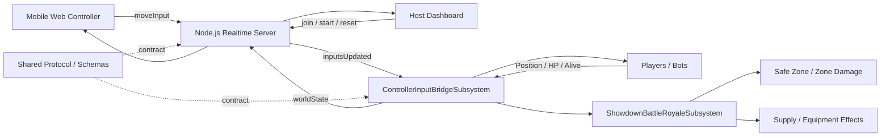

<div align="center">

# MIMI

**관객의 스마트폰 입력을 Unreal Engine 전장으로 연결한 실시간 참여형 Battle Royale**


[상세 포트폴리오](https://app.notion.com/p/3c3dbef4fbe580ef9666da5295424344) · [프로젝트 자료](https://drive.google.com/drive/folders/1v_6c-AecuchaAHTHRDPQTKgcLi-Pnd9d)

</div>

## 프로젝트 소개

MIMI는 **Multi-Input Media Immersion**의 약자로, 별도 앱을 설치하지 않고 QR 또는 URL로 접속한 관객의 스마트폰을 게임 컨트롤러로 바꾸는 실시간 콘텐츠 플랫폼입니다.

해커톤 데모에서는 모바일 조이스틱 입력을 Backend가 중계하고, Unreal Engine이 캐릭터 이동·충돌·전투·안전지대·보급품·HP와 생존 상태를 계산하는 Battle Royale을 구현했습니다. Unreal의 결과는 다시 Host Dashboard와 모바일 미니맵에 전달되어 관객과 발표자가 같은 전장 상태를 확인합니다.

| 항목 | 내용 |
| --- | --- |
| 개발 기간 | 2026.06.17 ~ 2026.06.19 |
| 프로젝트 형태 | 2박 3일 팀 해커톤 |
| 본인 담당 | 모바일 컨트롤러, 실시간 WebSocket 서버, Unreal 입력 브리지, Battle Royale Gameplay, Emote 연동 |
| 개발 환경 | Unreal Engine 5.7, C++ / Blueprint, Node.js / JavaScript |
| 플랫폼 | Windows, Mobile Web |
| 핵심 데이터 흐름 | `moveInput` → `inputsUpdated` → Unreal Simulation → `worldState` |

### 협업 범위

런타임별 구현은 분리하되, 모바일·Backend·Unreal 사이의 데이터 계약은 `shared/` 문서를 기준으로 맞췄습니다. 런타임에 필요한 변환은 각 Adapter 경계에서 처리하고 다른 도메인에 독자적인 메시지 형식을 만들지 않는 것을 원칙으로 했습니다.

| 영역 | 책임 |
| --- | --- |
| Mobile Web / Host | 참가, 조이스틱·Emote 입력, 게임 시작·리셋, 플레이어 상태 표시 |
| Backend | 참가자와 방 상태 관리, 입력 브로드캐스트, Unreal 및 Web 상태 중계 |
| Unreal PlayWorld | 캐릭터·봇 입력 적용, 전투와 안전지대, 보급품, HP·생존 상태의 권위 있는 계산 |
| Shared Contract | 공통 메시지 이름, payload 구조, JSON Schema와 호환성 기준 |

## 실행 방법

### 1. 실시간 서버 실행

Node.js가 설치된 Windows 환경에서 다음 명령을 실행합니다.

```bash
cd unreal/Hackathon_Sample
npm ci
npm start
```

서버가 실행되면 Host Dashboard는 `http://localhost:3000/host.html`에서 확인할 수 있습니다.

### 2. Unreal 데모 실행

1. `unreal/PlayWorld/PlayWorld.uproject`를 Unreal Engine 5.7로 엽니다.
2. 데모 레벨에 `ControllerInputPollingBridge` Actor가 하나만 배치되어 있는지 확인합니다.
3. `ServerBaseUrl`이 `http://localhost:3000`을 가리키는지 확인합니다.
4. PIE를 시작한 뒤 Host Dashboard에서 QR 또는 참가 URL을 표시합니다.
5. 모바일 브라우저로 참가하고 Host에서 게임을 시작합니다.

> `BattleRoyaleSettings`, 원형 경계와 카메라 값은 `ControllerInputPollingBridge`의 Details Panel에서 조정할 수 있습니다.

## 전체 구조



Backend는 입력 의도와 세션 상태를 빠르게 중계하고, Unreal은 실제 위치·충돌·데미지·생존 상태를 결정합니다. 모바일이 월드 Transform을 직접 보내지 않으므로 클라이언트 위치 조작을 줄이고, 사람과 봇이 같은 입력 경계를 사용할 수 있습니다.

관련 코드: [server.js](unreal/Hackathon_Sample/server.js), [ControllerInputBridgeSubsystem.cpp](unreal/PlayWorld/Source/PlayWorld/Private/ControllerInputBridgeSubsystem.cpp), [ControllerInputPollingBridge.cpp](unreal/PlayWorld/Source/PlayWorld/Private/ControllerInputPollingBridge.cpp)

## 1. 입력 의도 기반 실시간 동기화

모바일은 캐릭터 위치가 아니라 `moveX`, `moveY` 입력값을 전송합니다. Backend는 입력을 `inputsUpdated`로 브로드캐스트하고, Unreal의 `UControllerInputBridgeSubsystem`이 플레이어 ID와 캐릭터를 매핑해 이동에 적용합니다.

```text
모바일 조이스틱
  -> moveInput(moveX, moveY)
  -> Backend 입력 브로드캐스트
  -> inputsUpdated(playerId, moveX, moveY)
  -> Unreal 캐릭터 이동·충돌 계산
  -> worldState(worldX, worldY, hp, alive)
  -> Host Dashboard / Mobile Minimap
```

Transform의 시작점과 끝점만 전송하면 샘플 사이의 곡선 이동과 방향 변화가 사라집니다. 입력 벡터를 전달하면 Unreal이 프레임마다 이동 경로를 계산할 수 있고, 실제 충돌과 전투 결과도 같은 월드 상태 위에서 처리할 수 있습니다.

- 입력과 World State는 기본 `0.1초` 간격으로 동기화합니다.
- Unreal 상태가 아직 도착하지 않은 구간에는 서버 프리뷰를 유지합니다.
- 플레이어와 Web에서 생성한 봇은 같은 이동 입력 구조를 사용합니다.
- 등록되지 않은 플레이어나 유효하지 않은 입력은 캐릭터 적용 단계에서 제외합니다.

관련 코드: [ControllerInputBridgeSubsystem.h](unreal/PlayWorld/Source/PlayWorld/Public/ControllerInputBridgeSubsystem.h), [ControllerInputBridgeSubsystem.cpp](unreal/PlayWorld/Source/PlayWorld/Private/ControllerInputBridgeSubsystem.cpp), [MyCharacter.cpp](unreal/PlayWorld/Source/PlayWorld/Private/MyCharacter.cpp)

## 2. Battle Royale 안전지대와 생존 상태

게임이 `Playing` 상태로 전환되면 Unreal의 `UShowdownBattleRoyaleSubsystem`이 전장 규칙을 시작합니다. 기본 설정은 최대 4개 안전지대 페이즈이며, 각 페이즈에서 현재·다음 안전지대를 계산하고 축소 구간을 보간합니다.

```text
Warmup
  -> Phase 시작 및 보급품 생성
  -> 현재 안전지대 유지
  -> 다음 안전지대로 반경·중심 보간
  -> 안전지대 밖 캐릭터에 Zone Damage
  -> 다음 Phase 또는 최종 생존 판정
```

| 시스템 | 구현 내용 |
| --- | --- |
| Safe Zone | 현재·다음 중심과 반경 계산, 페이즈별 축소, 시각화 Actor 갱신 |
| Zone Damage | 안전지대 밖 캐릭터에 `DamagePerSecond × DeltaTime` 적용 |
| Supply | 페이즈별 보급품 생성, 이동 속도·공격력·사거리 효과 누적 |
| Death | HP가 0이 되면 이동·충돌·표시를 중단하고 `alive=false` 전송 |
| Reset | 다음 라운드에서 HP, 표시, 충돌, 이동과 전장 상태 복구 |

전장 규칙은 입력 브리지와 분리된 Subsystem이 소유합니다. 네트워크 연결이 캐릭터 입력을 담당하는 동안 Battle Royale Subsystem은 안전지대, 데미지, 보급품과 라운드 수명주기만 관리합니다.

관련 코드: [ShowdownBattleRoyaleSubsystem.cpp](unreal/PlayWorld/Source/PlayWorld/Private/ShowdownBattleRoyaleSubsystem.cpp), [SafeZoneVisualizerActor.cpp](unreal/PlayWorld/Source/PlayWorld/Private/SafeZoneVisualizerActor.cpp), [ZoneDamageReceiverComponent.cpp](unreal/PlayWorld/Source/PlayWorld/Private/ZoneDamageReceiverComponent.cpp), [SupplyDropActor.cpp](unreal/PlayWorld/Source/PlayWorld/Private/SupplyDropActor.cpp)

## 3. 원형 전장 경계와 Quarter View 카메라

Battle Royale의 플레이 영역은 사각형 좌표를 그대로 제한하지 않고 원형 경계로 처리합니다. 캐릭터가 경계에 닿으면 바깥쪽으로 향하는 입력 성분만 제거하고 접선 방향 이동은 유지합니다.

```text
입력 벡터를 경계의 바깥 방향 성분과 접선 성분으로 분해
  -> 바깥 방향 성분 제거
  -> 접선 이동 유지
  -> 충돌·Spawn 등으로 경계를 벗어나면 원 안쪽으로 위치 보정
```

`ABattleRoyaleZoneCameraActor`는 현재 안전지대 중심을 따라가며 전장 크기에 맞춰 시야를 보간합니다. 기본 카메라는 낮은 FOV와 긴 거리의 Perspective Quarter View를 사용해 3D 깊이를 유지하면서 바닥 원근 왜곡을 줄입니다.

- 기본 원형 경계 반경은 `3000` Unreal Unit입니다.
- 플레이어, 봇, 보급품의 초기 위치를 원 안에 생성하거나 보정합니다.
- 현재 안전지대는 내부 강조와 테두리, 다음 안전지대는 테두리로 구분합니다.
- 카메라는 안전지대 페이즈가 진행될수록 중심과 프레이밍을 부드럽게 갱신합니다.

관련 코드: [BattleRoyaleZoneCameraActor.cpp](unreal/PlayWorld/Source/PlayWorld/Private/BattleRoyaleZoneCameraActor.cpp), [SafeZoneVisualizerActor.cpp](unreal/PlayWorld/Source/PlayWorld/Private/SafeZoneVisualizerActor.cpp), [ControllerInputBridgeSubsystem.cpp](unreal/PlayWorld/Source/PlayWorld/Private/ControllerInputBridgeSubsystem.cpp)

## 4. Host Dashboard와 모바일 컨트롤러

Host Dashboard는 발표자가 참가자와 게임 상태를 제어하는 조종석입니다. QR 또는 터널 URL을 제공하고, 참가자 목록·상점·게임 시작·리셋과 실시간 플레이어 상태를 한 화면에서 관리합니다.

모바일 화면은 설치 과정 없이 브라우저에서 실행되며, 조이스틱 입력과 함께 미니맵·레이더·생존 결과를 표시합니다.

| 화면 | 주요 기능 |
| --- | --- |
| Host Dashboard | 참가 URL/QR, 플레이어 목록, 게임 상태, 시작·리셋, 2D 전장 프리뷰 |
| Mobile Controller | 닉네임 참가, 가상 조이스틱, 레이더, 더블 탭 줌, Emote |
| Unreal View | 캐릭터·봇, 전투, 안전지대, 보급품, 미니맵, 생존 결과 |

관련 코드: [host.html](unreal/Hackathon_Sample/public/host.html), [host.js](unreal/Hackathon_Sample/public/js/host.js), [index.html](unreal/Hackathon_Sample/public/index.html), [mobile.js](unreal/Hackathon_Sample/public/js/mobile.js)

## 5. Emote 입력과 중복 재생 방지

모바일에서 발생한 Emote는 플레이어 상태와 함께 Unreal에 전달됩니다. Unreal은 플레이어별 마지막 `emoteSeq`를 저장하고, 이전보다 큰 sequence가 도착했을 때만 새 Emote로 처리합니다.

```text
Mobile Emote Input
  -> emoteSeq 증가
  -> Backend 상태 브로드캐스트
  -> Unreal이 LastEmoteSeqByPlayerId와 비교
  -> 새 sequence인 경우에만 캐릭터 Emote 재생
```

이 방식은 상태 스냅샷이 반복 전송되어도 같은 Emote가 매번 재생되는 것을 막습니다. 표현은 캐릭터 머리 위의 Screen Space `UWidgetComponent`로 분리하여 Gameplay 입력 처리와 UI 표시 책임을 나눴습니다.

관련 코드: [EmoteComponent.cpp](unreal/PlayWorld/Source/PlayWorld/Private/Emote/EmoteComponent.cpp), [EmoteProxy.cpp](unreal/PlayWorld/Source/PlayWorld/Private/Emote/EmoteProxy.cpp), [ControllerInputBridgeSubsystem.cpp](unreal/PlayWorld/Source/PlayWorld/Private/ControllerInputBridgeSubsystem.cpp)

## 주요 코드

| 파일 | 역할 |
| --- | --- |
| [server.js](unreal/Hackathon_Sample/server.js) | 참가자·게임 상태 관리, 모바일 입력과 Unreal 상태 중계 |
| [ControllerInputBridgeSubsystem.cpp](unreal/PlayWorld/Source/PlayWorld/Private/ControllerInputBridgeSubsystem.cpp) | 입력 수신, 플레이어·봇 매핑, 캐릭터 적용, World State 동기화 |
| [ControllerInputPollingBridge.cpp](unreal/PlayWorld/Source/PlayWorld/Private/ControllerInputPollingBridge.cpp) | 레벨 배치형 Bootstrap Actor와 설정 전달 |
| [ShowdownBattleRoyaleSubsystem.cpp](unreal/PlayWorld/Source/PlayWorld/Private/ShowdownBattleRoyaleSubsystem.cpp) | 안전지대 페이즈, 보급품, 존 데미지와 전장 수명주기 |
| [MyCharacter.cpp](unreal/PlayWorld/Source/PlayWorld/Private/MyCharacter.cpp) | 이동, 공격, HP, 사망·복구와 Emote 연결 |
| [BattleRoyaleZoneCameraActor.cpp](unreal/PlayWorld/Source/PlayWorld/Private/BattleRoyaleZoneCameraActor.cpp) | 안전지대 중심 추적과 Quarter View 프레이밍 |
| [BattleRoyaleMinimapWidget.cpp](unreal/PlayWorld/Source/PlayWorld/Private/BattleRoyaleMinimapWidget.cpp) | 플레이어·보급품·안전지대 미니맵 표시 |
| [shared/protocol/WebSocketMessages.md](shared/protocol/WebSocketMessages.md) | 도메인 간 공통 메시지 계약 |

## 디렉터리 구조

```text
MIMI/
├─ docs/                           # 아키텍처와 도메인별 설계 문서
├─ shared/
│  ├─ protocol/                    # WebSocket 메시지 계약
│  └─ schemas/                     # 공통 JSON Schema
├─ backend/showdown-spring/        # Spring Boot 기반 Backend 구현
├─ unreal/
│  ├─ Hackathon_Sample/            # Node.js 실시간 서버와 Host/Mobile Web
│  └─ PlayWorld/
│     ├─ Content/                   # 맵, UI, 캐릭터와 Gameplay 에셋
│     └─ Source/PlayWorld/          # Unreal C++ Gameplay와 연동 코드
├─ ai/                             # 비동기 AI 확장 영역
├─ ta/                             # Technical Art 가이드와 에셋 규칙
├─ infra/                          # 배포·운영 확장 영역
└─ outputs/                        # 프로젝트 발표 자료
```

## 사용 기술

- **Unreal Engine 5.7**: Actor, Actor Component, GameInstance Subsystem, UMG, HTTP, WebSocket
- **C++ / Blueprint**: 입력 브리지와 전장 규칙은 C++, 레벨·에셋 연결은 Blueprint
- **Node.js / Express / Socket.IO / ws**: Host·Mobile·Unreal 사이의 실시간 입력과 상태 중계
- **HTML / CSS / JavaScript**: Host Dashboard와 모바일 조이스틱·레이더 UI
- **Spring Boot / Java / H2**: 별도 Backend 구현과 게임 결과·참여 데이터 영속화
- **JSON Schema**: 도메인 사이의 공통 메시지 구조와 호환성 문서화
- **Git / GitHub**: 기능 브랜치와 Pull Request 기반 팀 협업

## 링크

- [상세 Notion 포트폴리오](https://app.notion.com/p/3c3dbef4fbe580ef9666da5295424344)
- [프로젝트 자료](https://drive.google.com/drive/folders/1v_6c-AecuchaAHTHRDPQTKgcLi-Pnd9d)
- [공유 에셋](https://drive.google.com/drive/folders/1TBHWYKSurPqa-FkY8F3ChzGslxr0llcC?ths=true)

---

> 본 저장소는 팀 해커톤에서 제작한 프로젝트의 전체 Git 이력과 협업자 기여를 보존합니다.
